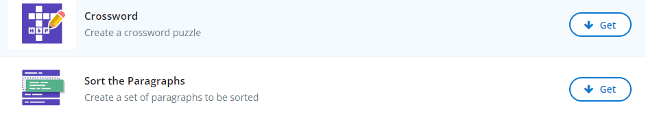

 

# Crosswords, Paragraph Sort and Find the Words Activities
## Crosswords
1. In WordPress, select **My Sites** in the upper toolbar. Then, on the left sidebar, select **H5P Content**  and then **Add new**
2. Once add new is selected, a bunch of options will appear with a box including **Search for content types**.
3. In the search for content types box, type **Crossword** and click on  **get** and **install**
4. After this, the ‘Get’ button will be replaced with a blue ‘Use’ button. Click on it.
5. Then press use.
6. It will now ask for a title, for this activity you can choose your own or follow along with our example. Type **Campus Facts**.
7. Next for the task description include the following: **Name the university building based on the clues that are given.**
8. Under words, add  the following clue: **the name of the UVic fountain**, answer **petch**.
9. Next click on word 2 and write the following clue: **the building the Digital Scholarship Commons is in?**, answer **mcpherson**
10. Next, click the blue **add word box**
11. Click on word 3 and write **The Faculty of Education advising  building**, answer **maclaurin**
12. Finally add one last question by repeating step 10.
13. For the clue, write: **the cement structure outside of Maclaurin is called**, answer **ziggurat**
14. For this one lets add an extra clue by adding an image. So select **image** on the drop down.
15. Download this [image](https://images.app.goo.gl/KJ6TvjzCRypjkko19){:target="_blank"}
16. Once it is downloaded, click the add button in the H5P window and select that image.
<iframe src="https://brittanyseducblog.opened.ca/wp-admin/admin-ajax.php?action=h5p_embed&id=4" width="400" height="500" frameborder="0" allowfullscreen="allowfullscreen" title="Campus Facts"></iframe> 
Congratulations you have created a crossword. 

## Sort the paragraphs
Repeat steps 1-5 except instead of crossword select **sort the paragraphs**
1. First title your project as **Alphabet sort**
2.  Next under the task description, include the following **Use the arrows to sort the following sentences in order that they typically would occur by placing the first item on the top and the last on the bottom.**
3. Next under the paragraph tab include various words, for example type **animal**
4. Next click **add paragraph** (blue button on bottom left side)
5. Other words you could for example are: **bear, cat, dog, elephant**
   Note: Make sure when you add them you add them in the correct order.
6. Under behavioural settings modify the scoring mode by selecting the toggle and changing it to **correct sequence**
7. Finally select the green **create** button on the right side of the screen.
Congratulations you created a paragraph sort activity. Great work.   
<iframe src="https://brittanyseducblog.opened.ca/wp-admin/admin-ajax.php?action=h5p_embed&id=5" width="475" height="415" frameborder="0" allowfullscreen="allowfullscreen" title="Alphabet sort"></iframe> 

## Find the words
Repeat steps 1-5 except instead of crossword select **Find the words**
1. First title your project as **word search**
2.  Next under the task description, keep the existing description of **Find the words from the grid**
3. Next under the word list tab include various words separated by commas only (no spaces), for instance **one,two,three.four**.
4. Then click the green **create button**
   Note: Make sure when you add them you add them in the correct order.
6. Under behavioural settings modify the scoring mode by selecting the toggle and changing it to **correct sequence**
7. Finally select the green **create** button on the right side of the screen
<iframe src="https://brittanyseducblog.opened.ca/wp-admin/admin-ajax.php?action=h5p_embed&id=7" width="575" height="400" frameborder="0" allowfullscreen="allowfullscreen" title="word search"></iframe> 
Congratulations you created a word search activity. Great work. 
[NEXT STEP: Interactive Images](images-interactive.html){: .btn .btn-blue } 
