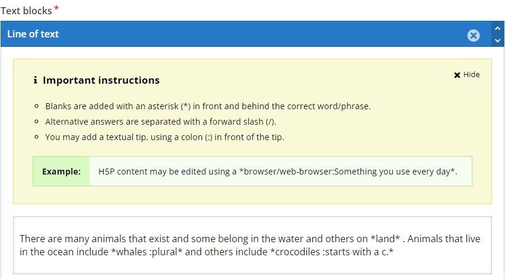
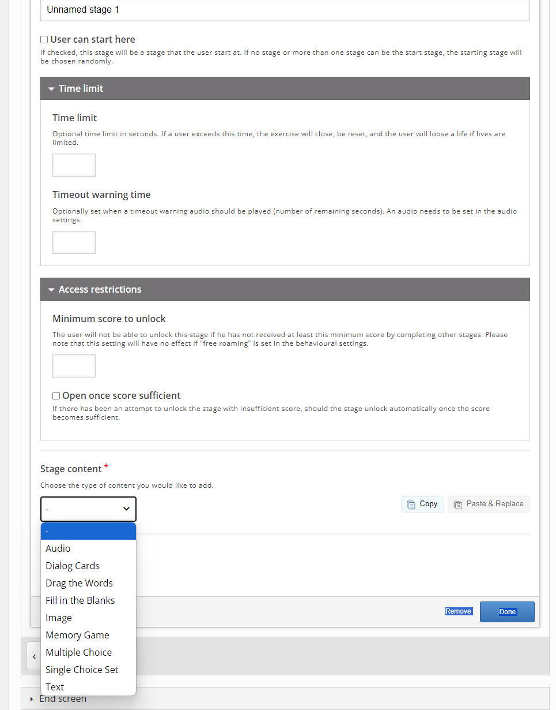

## Creating a Game Map using H5P

1. In Wordpress, select my site in the upper toolbar, then on the left hand side select **H5P Content** and select **Add new**
2. Once add new is selected, a bunch of options will appear with a box including **Search for content types**.
3. In the search for content types box, type **Game map** and click on  **Get** and **Install**
4. Once you have done this, the *get* button should be replaced with a blue **Use**. Click that.
5. You can also try the content demo, which is also linked [here](https://h5p.org/content-types/game-map#example=1463359){:target="_blank"}.
 
6. You can title your project, for the purpose of this workshop you can title it Learning adventure.
7. Add a background image, we will use the following image, so please [download the photo by cottonbro studio](https://www.pexels.com/photo/assorted-children-toys-3661243/){:target="_blank"}. 
8. Once downloaded, select **Add** to the background image.
9. Now click on **step 2, game map** and toggle the first icon, which is a star, which says **add exercise stage** when you toggle over it.
10. **Dialog cards**
    - first label the stage, we can label the first one as beginning.
    - Scroll down to the **Stage Content** and toggle to select **dialog cards**. This is like using flash cards to study.
    - You can title it as **what animal swims?** no need for a heading or task description but you can add if you would like.
    - Under **mode** Select **normal mode**
    - Under dialog: enter the text **What animal swims?** and then enter **whale** as the answer.
    - Finally press **done**
11. Repeat step 9 to then select the following **stage content**: **Fill in the Blanks**
    - You can name the stage label **water creatures** and title it **Fill in the blank**
    - Keep the task description as the existing text, **Fill in the missing words**. You can also add more descriptions if you would like
    - Finally, under the text blocks copy and paste the following:**There are many animals that exist and some belong in the water and others on *land* . Animals that live in the ocean include *whales :plural* and others include *crocodiles :starts with a c.***
    - Also see screenshot for important instructions on when to use an asterisk, forward slash and colon. 
 
    - Under behavioural settings you can select by clicking the box to link to the beginning box.
    - Then select done. Once done select publish on right had side of the page.
12. Now when you visit H5P content on your wordpress page you should be able to see the learning adventure game map you just created and you can go back and edit it anytime by selecting edit.

Other possible stage content to explore include audio, drag the words, image, memory game, multiple choice, single choice set, and regular text. Feel free to explore these extra tools to create your interactive game map. 

Note you can also add time limits per questions and restrictions (mandating a minimum score to move on for instance) and feedback. Those features are located following the stage label.

Congratualations you have created an interactive game map!

<iframe src="https://h5p.org/h5p/embed/1466205" width="1090" height="870" frameborder="0" allowfullscreen="allowfullscreen" allow="geolocation *; microphone *; camera *; midi *; encrypted-media *" title="Solar system simplified"></iframe>

[NEXT STEP: Crosswords,Paragraphs and WordSearch](crosswords-para.html){: .btn .btn-blue } or 
