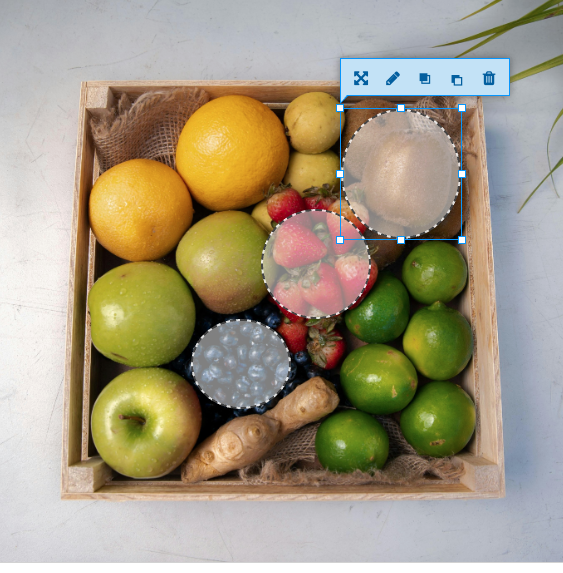

# Hotspot Activities
Activities included: Image Hotspots and Multiple Hotspots

### Image Hotspots
1. In Wordpress, select my site in the upper toolbar, then on the left hand side select **H5P Content** and select **Add new**
2. Once add new is selected, a bunch of options will appear with a box including **Search for content types**.
3. In the search for content types box, type **Image Hotspots** and click on  **get** and **install**
4. Once you have done this you the get button should be replaced with a blue **use**. Click that.
5. Title your project as **Fruit Smoothie**
6. Download the following [Image](https://www.pexels.com/photo/strawberry-smoothie-on-glass-jar-775032/){:target="_blank"}
7. Next, add that image as the **background image** by clicking the **+ Add** button. Find it in your downloads or wherever you saved the image.
8. You can add an alternative text such as **fruit recipe for smoothie**
9. Now you can elect the hotspot icon, we will use a **predefined icon**
10. For this workshop, I will use the predefined **info icon**.
11. My hotspot colour will be #1d3b99, but feel free to select your own by using the toggle.
12. **Hotspot**: Click on the bananas on the image. Sometimes you have to double click.
13. Finally for the **Popup content**, select **text** from the toggle
14. Write **3 bananas**
15. We will **add hotspot** by clicking the blue bottom at the bottom
16. We will repeat step 8 but select the strawberries this time.
17. You will add a header of strawberries
18. Finally for the **Popup content**, select **video** from the toggle.
19. Title it as **Strawberry Banana Smoothie**
20. For video source, paste the following link [https://www.youtube.com/watch?v=TJPhWB67_lA](**https://www.youtube.com/watch?v=TJPhWB67_lA**){:target="_blank"}
21. Finally return to the top and on the right side, click the **Create** button

<iframe src="https://brittanyseducblog.opened.ca/wp-admin/admin-ajax.php?action=h5p_embed&id=11" width="675" height="1036" frameborder="0" allowfullscreen="allowfullscreen" title="Fruit Smoothie"></iframe> 

### Multiple Hotspots and/or Find the Hotspot (same steps apply)
1. In Wordpress, select my site in the upper toolbar, then on the left hand side select **H5P Content** and select **Add new**
2. Once add new is selected, a bunch of options will appear with a box including **Search for content types**.
3. In the search for content types box, type **Find Multiple Hotspots** and click on  **get** and **install**
4. Once you have done this you the get button should be replaced with a blue **use**. Click that.
5. Title your project as **Berries**
6. Please now download the [following image](https://www.pexels.com/photo/assorted-fruits-on-a-box-6654941/){:target="_blank"}
7. Now under background image, click the **+ add** button, and select the previously downloaded image (step 6) and press **open**
8. Now, toggle to the step 2 Hotspots
9. For the task description, write **Select the berries**
10. Hotspot name is **berries**
11. Write the number of correct hotspots, which for this example will be **2**
12. Add the hotspots, by clicking the round or rectangle button, clicking the **correct box**, and dragging it onto the correct fruit, in this case drag onto the blueberries.
13. Next repeat step 12 but add hotspot onto strawberries.
14. Now lets also add one hotspot that is incorrect, repeat step 12 but do not tick the correct box. and drag to the kiwis for example. Add feedback such as **Incorrect this is a kiwi, try again**
15. Leave the pre programmed feedback in the bottom two boxes. Empty box: **You didn't locate any hotspots, try again!** and for users who have already found hotspot: **You already found this one!**
16. Finally find and select the green **create button on the right hand side**
Note the hotspots are pretty specific to the location so lets go back and edit to make it easier.
17. On the left side at the top select **edit**
18. Select **hotspots**
19. Click on desired hotspot and enlarge it by dragging one of the corners of the box.
20. In the edit view, should now look like this see screenshot.
 
22. Now press the **update** button on right side. 

<iframe src="https://brittanyseducblog.opened.ca/wp-admin/admin-ajax.php?action=h5p_embed&id=20" width="958" height="796" frameborder="0" allowfullscreen="allowfullscreen" title="Berries"></iframe>

[NEXT STEP: Study Cards](study-cards.html){: .btn .btn-blue }  or
