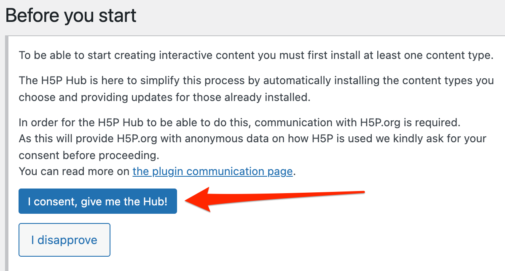
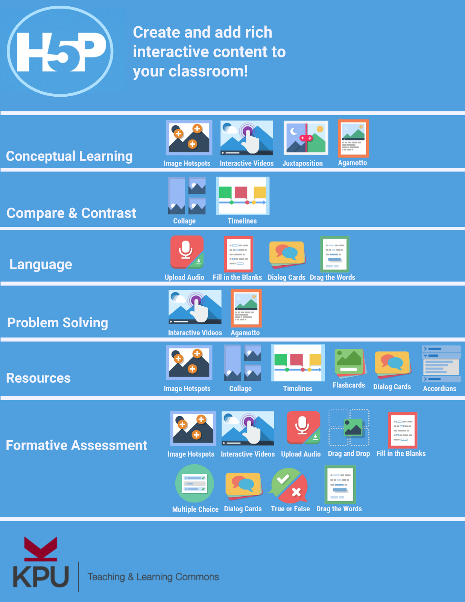

 
# H5P Plugin Installation

1. If you haven’t done so already, install the H5P plugin in your [OpenEd.ca blog](https://opened.ca/get-started/){:target="_blank"} for this exercise if you don’t already have one.
2. Create a Username, Sign up using your Netlink email and then select **Give me a site** and next. (see photo).                                                                              

- Next  once you have selected Add New, select **interactive videos**, you’ll need to click on the **Get** button beside the top item (Interactive video). .
- Press **install** 

Great Job! 
 

[NEXT STEP: Interactive videos](interactive-video.html){: .btn .btn-blue } 
