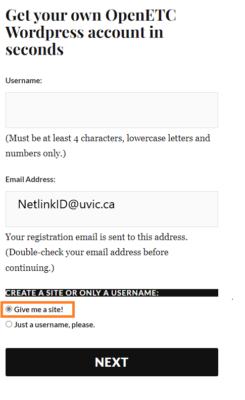

## Pre-Workshop Videos & Activities
This workshop focuses on hands-on practice with **H5P** to help you learn its key features. To make the most of the session, please complete the following **before the workshop**:

**Pre-workshop activity**
- Create an OpenEd.ca account and website on the following web page. **Please make sure to use your UVic.ca email address when asked for an email address**: [OpenEd Account & Wordpress Website Setup](https://opened.ca/wp-signup.php){:target="_blank"}.
- Create a Username, Sign up using your Netlink email and then select **Give me a site** and next. (see photo).                                                                              

**Optional** 
- [Introduction to h5P](https://www.youtube.com/watch?v=jAnkWFBXW_o){:target="_blank"} 
- [Making videos accesible](https://www.youtube.com/watch?v=0wMEqf6Rjeg){:target="_blank"} 
<iframe width="560" height="315" src="https://www.youtube.com/embed/0wMEqf6Rjeg?si=-wEOTgfJJkSlZdXo" title="YouTube video player" frameborder="0" allow="accelerometer; autoplay; clipboard-write; encrypted-media; gyroscope; picture-in-picture; web-share" referrerpolicy="strict-origin-when-cross-origin" allowfullscreen></iframe> 
- [Export and Import h5P files](https://www.youtube.com/watch?v=kDlXkhsDD_0){:target="_blank"} 
- Overview of activity 2 [Adding h5P plugin to Wordpress](https://www.youtube.com/watch?v=4n7gfHmNUGc){:target="_blank"} 
- [Engaging Makerspace Instruction & Self-Assessment Using the Open Source Lumi Toolkit](https://www.youtube.com/watch?v=7KqNbzQkq9U){:target="_blank"} (2min) 
<iframe width="560" height="315" src="https://www.youtube.com/embed/7KqNbzQkq9U?si=jXnTbV84waAU9J5K" title="YouTube video player" frameborder="0" allow="accelerometer; autoplay; clipboard-write; encrypted-media; gyroscope; picture-in-picture; web-share" referrerpolicy="strict-origin-when-cross-origin" allowfullscreen></iframe>

[NEXT STEP: Introduction to Hands-On Activities](activities-intro.html){: .btn .btn-blue }
